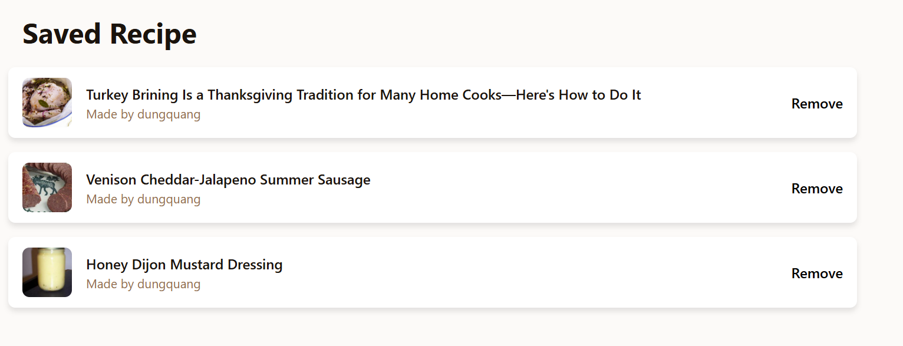

# RecipeHub
Web chia sẻ công thức nấu ăn

Nhớ chạy npm install khi clone về

###This frontend part using Tailwind CSS

<h3>Những thay đổi ở phiên bản này</h3>
  Hoàn thành trang HomePage.
  Thêm chức năng checkShoppingList, addShoppingList, deleteShoppingList
 Lưu ý: Chức năng API chưa được test.
 HomePage: hiển thị rating với tác giả 

<h2>Những thay đổi quan trọng</h2>
<ul>
<li>Ở bảng users, thêm cột image và đặt giá trị default của nó là http://localhost:3002/uploads/default_avatar.png</li>
<li>Thay đổi route get Favourite để lấy thông tin về tác giả</li>

<li>Không cần cập nhật cho package.json ở Frontend vì cái JWT-ĐECODE KHÔNG CHẠY</li>
</ul>
